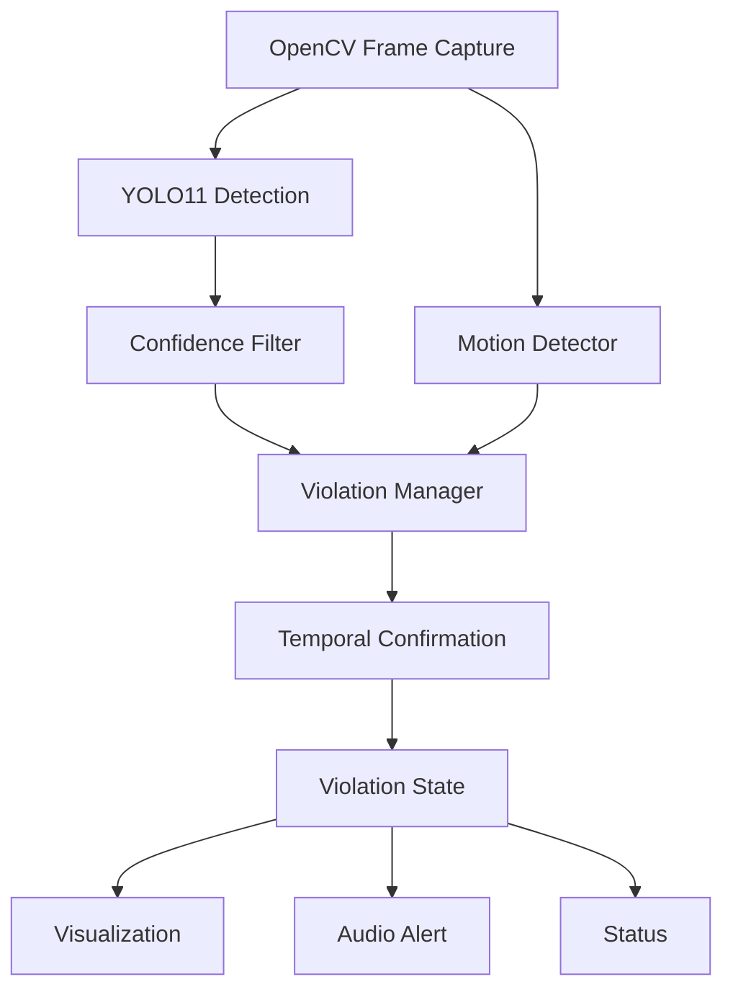
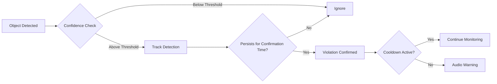

# DriverSafetyAI 🚗

> Real-Time AI Driver Safety & Violation Detection System

DriverSafetyAI is an AI-powered real-time driver monitoring system that detects unsafe driving behaviors using YOLO11, OpenCV, and Python. It identifies phone usage, smoking, and seatbelt violations with temporal confirmation logic — eliminating false alarms from single-frame detections — and triggers real-time audio warnings.

---

## How It Works



The system does not trigger on a single frame. A violation must persist continuously for the confirmation period before an alert fires. This eliminates false alarms from momentary or unstable detections.

---

## Features

*  Mobile Phone Detection — Detects phone usage while driving
*  Smoking Detection — Detects smoking-related behavior while driving
*  Seatbelt Detection — Detects seatbelt violations
*  Real-Time Webcam & Video Support — Works with live camera feeds and video files
*  YOLO11 Object Detection — Real-time object detection using a trained YOLO11 model
*  Temporal Violation Confirmation — Requires a detection to persist before confirming a violation
*  Vehicle Motion Detection — Uses optical-flow-based motion analysis to determine vehicle movement
*  Real-Time Audio Alerts — Plays warning sounds for confirmed violations
*  Violation State Management — Supports individual and combined violation states
*  False-Positive Reduction — Uses confidence filtering, temporal confirmation, and warning cooldowns
*  Live Detection Visualization — Displays bounding boxes, labels, confidence scores, and system status
*  Centralized Configuration — Detection and system parameters are managed through config/config.py
*  Modular Python Architecture — Detection, motion analysis, violation management, audio, and visualization are separated into       independent modules

---

## Violation States

The system handles individual and combined violations simultaneously:

| State | Trigger |
|-------|---------|
| NORMAL | No violations detected |
| PHONE_VIOLATION | Phone detected while driving |
| SMOKING_VIOLATION | Smoking detected while driving |
| SEATBELT_VIOLATION | No seatbelt detected |
| PHONE_SMOKING_VIOLATION | Phone + smoking simultaneously |
| PHONE_SEATBELT_VIOLATION | Phone detected + no seatbelt |
| SMOKING_SEATBELT_VIOLATION | Smoking detected + no seatbelt |
| ALL_VIOLATION | Phone + smoking + no seatbelt |

---

## Model Performance

Trained on the **DMS (Driver Monitoring System)** dataset using YOLO11n with transfer learning.

**Dataset:**

| Split | Images |
|-------|--------|
| Train | 5,957 |
| Valid | 2,389 |
| Test | 1,538 |
| **Total** | **9,884** |

**Results after 100 epochs:**

| Class | Precision | Recall | mAP50 | mAP50-95 |
|-------|-----------|--------|-------|----------|
| Phone | 0.853 | 0.845 | 0.891 | 0.671 |
| Smoker | 0.890 | 0.819 | 0.887 | 0.557 |
| **Overall** | **0.871** | **0.832** | **0.889** | **0.614** |

The model was fine-tuned with hard-negative examples (pens, wires, fingers, caps) to reduce false positives on cigarette-like objects.

---

## False Positive Reduction



Temporal confirmation + confidence threshold + hard-negative fine-tuning work together to minimize false alarms without missing real violations.

---
## Model Improvement Pipeline

The model went through multiple rounds of targeted fine-tuning to improve real-world performance:

**Round 1 — Base Training**
- Trained YOLO11n on DMS dataset (5,957 images, 100 epochs)
- Good overall performance but some false positives on cigarette-like objects

**Round 2 — Hard Negative Fine-tuning**
- Added negative examples: pens, fingers, wires, bottle caps
- Reduced false positives on non-smoking objects
- Model: `best_finetuned_pen_fix.pt`

**Round 3 — Hard Positive Fine-tuning (Current)**
- Added 100 difficult smoking examples: burning cigarettes, faint smoke, partial occlusion
- Fine-tuned from `best_finetuned_pen_fix.pt` (not from scratch)
- ~10 epochs only — preserves existing knowledge, adds difficult cases
- Goal: detect low-smoke and partially visible cigarettes without reintroducing false positives

**Why fine-tune instead of retrain?**
Fine-tuning from an existing checkpoint is faster and safer than full retraining. The model already knows phone and seatbelt well — we only need to improve difficult smoking detection. Starting from scratch would risk losing that existing knowledge.

## Tech Stack

| Technology | Purpose |
|------------|---------|
| Python 3.11 | Core application |
| YOLO11 / Ultralytics | Object detection |
| PyTorch | Deep learning backend |
| OpenCV | Video processing + optical flow |
| Pygame | Non-blocking audio alerts |
| NumPy | Numerical processing |

---

## Project Structure

```
DriverSafetyAI/
│
├── app.py                    # Main application entry point
├── train.py                  # YOLO training pipeline
├── requirements.txt          # Python dependencies
├── README.md                 # Project documentation
├── .gitignore                # Ignored files and directories
│
├── config/
│   └── config.py             # Centralized system configuration
│
├── src/
│   ├── __init__.py
│   ├── detector.py           # YOLO inference and confidence filtering
│   ├── motion_detector.py    # Vehicle motion detection via optical flow
│   ├── violation_manager.py  # Temporal confirmation and violation states
│   ├── audio_alert.py        # Non-blocking threaded audio warnings
│   ├── visualization.py      # Bounding boxes and status overlays
│   └── roi.py                # Driver region-of-interest processing
│
├── audio/
│   └── warning.wav           # Auto-generated warning sound
│
└── models/
    └── best.pt               # Trained YOLO11n weights
```

---

## Installation

```bash
# 1. Clone
git clone https://github.com/pranjul075/DriverSafetyAI.git
cd DriverSafetyAI

# 2. Create environment
python3.11 -m venv venv
source venv/bin/activate        # macOS/Linux
venv\Scripts\activate           # Windows

# 3. Install dependencies
pip install -r requirements.txt

# 4. Add trained model
# Place best.pt inside models/
```

**Model classes:**
0 → smoking
1 → phone
2 → seatbelt

---

## Run

```bash
# Webcam
python3.11 app.py --source 0

# Video file
python3.11 app.py --source driving.mp4
```

**Controls:**

| Key | Action |
|-----|--------|
| Q | Quit |
| SPACE | Pause / Resume |

---

## Configuration

All parameters are centralized in `config/config.py`:

```python
CONFIDENCE_THRESHOLD = 0.80   # Minimum YOLO confidence
CONFIRMATION_TIME    = 2.0    # Seconds before violation confirmed
WARNING_COOLDOWN     = 1.0    # Seconds between audio warnings
MOTION_THRESHOLD     = 2.0    # Optical flow sensitivity
```

---

## Architecture Highlights

**Temporal Confirmation** — detections must persist continuously for `CONFIRMATION_TIME` seconds. If the detection disappears even briefly, the timer resets. This is the core mechanism that separates a robust safety system from a naive single-frame detector.

**Modular Design** — each component is independent. The motion detector can be swapped from optical flow to GPS or OBD-II speed with zero changes to other modules.

**Non-blocking Audio** — warnings run in daemon threads so audio never blocks the video pipeline.

**Vehicle Motion Detection** — Dense Optical Flow (Farneback algorithm) estimates vehicle movement. Phone and smoking violations only trigger when moving. Seatbelt violations trigger regardless.

---

## Limitations

- Camera-based motion estimation can be affected by lighting changes, camera shake, or other moving objects
- Low lighting reduces detection accuracy
- This is a **computer vision research prototype** — not a certified automotive safety system
- In production, vehicle motion should use GPS or OBD-II speed data

---

## Future Extensions

- Head pose estimation for distraction detection
- Eye state monitoring for drowsiness detection
- GPS / OBD-II speed integration
- Embedded deployment on NVIDIA Jetson
- Multi-camera support for wider coverage

---

## Key Learnings

- Dataset quality matters more than model complexity
- Hard-negative fine-tuning is more effective than simply raising confidence threshold
- Temporal confirmation significantly reduces real-world false alarms
- Modular architecture makes AI systems easier to debug and extend
- Real-world testing reveals failure cases that benchmark metrics miss

---

## Project Status

| Feature | Status |
|---------|--------|
| Phone detection | ✅ Complete |
| Smoking detection | ✅ Complete |
| Seatbelt detection | ✅ Complete |
| Temporal confirmation | ✅ Complete |
| Vehicle motion detection | ✅ Complete |
| Audio warnings | ✅ Complete |
| Combined violations | ✅ Complete |
| Hard-negative fine-tuning | ✅ Complete |

---

**GitHub:** https://github.com/pranjul75/DriverSafetyAI

Built with Python · YOLO11 · PyTorch · OpenCV · Pygame
